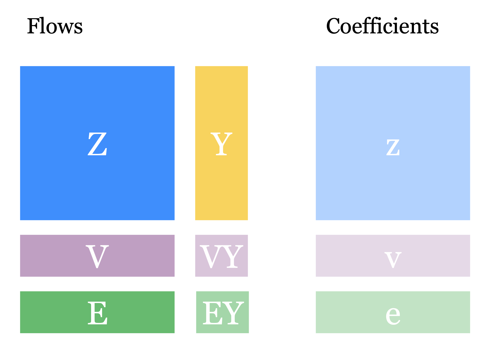
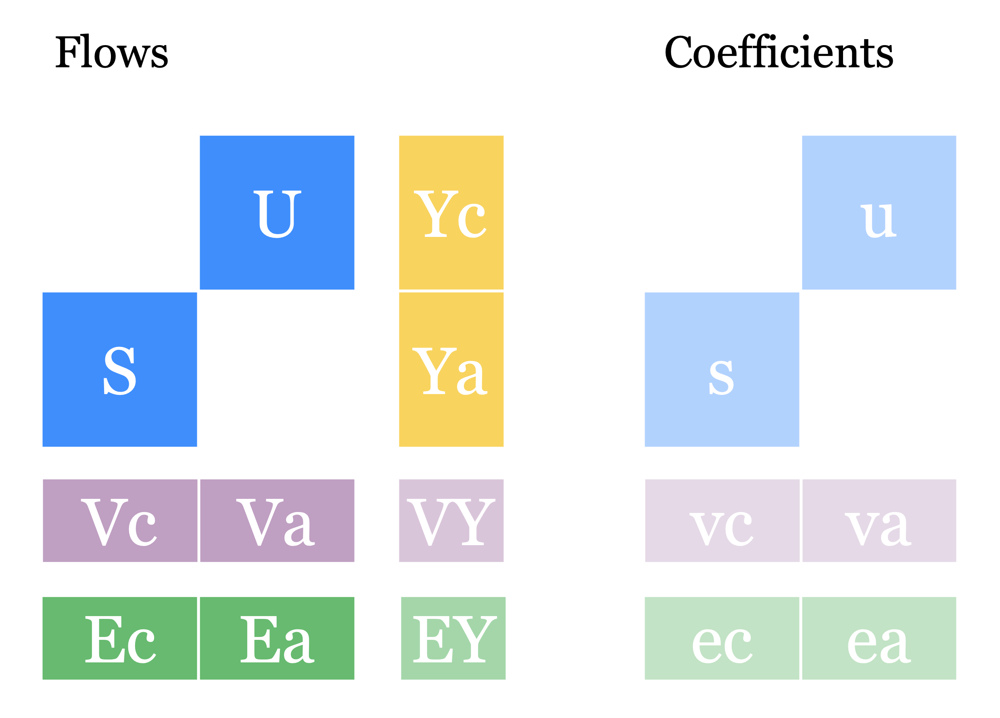

Table formats
=============

MARIO handles both Input-Output Tables (IOTs) and Supply and Use Tables
(SUTs). They share many workflows, but they do not carry the same internal
structure.

.. _concept-iots:

Input-Output Tables (IOTs)
--------------------------

IOTs, also known as symmetric input-output *tables*, represent a squared representation of a productive system.
The main native *flow* *matrices* are:

* ``Z`` for intersectoral flows
* ``Y`` for final demand
* ``V`` and ``VY`` for factors of production
* ``E`` and ``EY`` for satellite accounts

From these flow matrices MARIO can derive *coefficient* *matrices* such as ``z``,
``v`` and ``e`` (and viceversa), the total production vector ``X``, and demand-driven results
such as footprints (``f`` and ``F``), multipliers (``m`` and ``M``) and prices indices (``p``).

   Native IOT flows matrices on the left and the corresponding coefficient matrices
   on the right. Matrices ``Y``, ``VY`` and ``EY`` are always expressed in flows

.. _concept-suts:

Supply-Use Tables (SUTs)
------------------------

SUTs, unlike IOTs, distinguish between commodities and the activity supplying them. The
native flow *matrices* are split into activity-side and commodity-side blocks:

* ``U`` and ``S``
* ``Yc`` and ``Ya``
* ``Vc``, ``Va`` and ``VY``
* ``Ec``, ``Ea`` and ``EY``

While ``U`` and ``S`` are commonly known in input-output literature as Use and
Make or Supply *matrices*, MARIO uses the ``a`` and ``c`` suffixes to indicate
the activity-side and commodity-side parts of ``Y``, ``V`` and ``E``.

**Some of these matrices may be entirely null and therefore absent in some databases!**

   Native SUT flows matrices on the left and the corresponding coefficient matrices
   on the right. Matrices ``Yc``, ``Ya``, ``VY`` and ``EY`` are always expressed in flows

.. important::

   MARIO can also generate unified views for SUTs such as ``Z``, ``Y``, ``V`` and
   ``E`` on top of the standard matrices. These are convenient for inspection and
   some exports, but they are not the most native representation of a SUT
   database. This feature is particularly useful for retrocompatibility with
   versions up to v0.3.5.

.. important::

   When computing a *matrix*,  MARIO will calculate all the dependencies automatically.

Why this matters
----------------

In principle, many operations are common to both *table* formats. One can even
apply the same mathematics of IOTs to SUTs in a formal sense: see `Lenzen and
Rueda-Cantuche 2012 <https://www.idescat.cat/sort/sort362/36.2.2.lenzen-cantuche.pdf>`_.
In practice, however, efficient SUT formulas depend on the underlying supply
and use structure. Parsing, calculations and table transformations therefore
need to know whether a database is IOT or SUT.

Check available matrices in a database
--------------------------------------

*Matrices* are stored in a dictionary within the database class and are defined
for each :doc:`scenario <../concepts/scenarios>`.

If you want to check which matrices are available in the ``baseline`` scenario:
 
.. code-block:: python

   db.matrices['baseline']

The resulting list is dynamic: after parsing the database, every *matrix* the
user computes is stored in this dictionary.

Upcoming work
-------------

Further developments may envisage the inclusion of **Social Accounting Matrices (SAMs)**.
Let us know if you are interested in having SAMs or other 
table formats by opening an enhancement issue on 
`GitHub <https://github.com/it-is-me-mario/MARIO/issues>`_!
