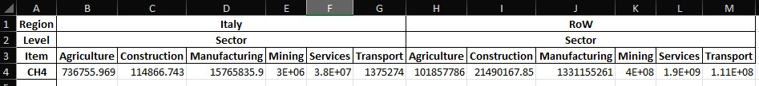

Adding satellite accounts
=========================

This tutorial shows how to possibly add satellite accounts to any
mario.Database object

Background
----------

Input-output tables are not necessarily enriched with satellite accounts
(i.e. environmentally-extended). However, in the field of industrial
ecology and life-cycle assessment (LCA), it is paramount each industrial
activity is characterized also in terms of its interactions with the
external environment. Satellite accounts may cover also
non-environmental information, such as employment (e.g. employed people
by each activity)

Having the possibility to extend IOTs and SUTs to additional accounts
may be helpful for many analysts and modellers.

Adding extensions on a custom IOT
---------------------------------

Starting from the test IOT matrix of mario, we can see the table has
four satellite accounts

.. code:: ipython3

    import mario  # Import MARIO
    
    test_IOT = mario.load_test(table='IOT')
    test_IOT.get_index('Satellite account')

.. parsed-literal::

    ['Employment', 'CO2', 'Water Consumption Blue', 'Energy']

Preparing data in Excel
~~~~~~~~~~~~~~~~~~~~~~~

Let’s assume we desire to extend the table to account for “CH4”
emissions. First, we need to prepare the data in the proper format in
Excel. MARIO provides an Excel template by calling the
‘get_extensions_excel’ method

.. code:: ipython3

    path = 'add_extensions/new_E_accounts.xlsx'
    test_IOT.get_extensions_excel(matrix='E',path=path)

The data is then filled with the desired information, in this case
regarding CH4 emissions. These data needs to be collected separately by
the analyst.

   Alt text

This data can be parsed using pandas ‘read_excel’ method. In this case
the data are stored in the file targeted by the given path and in the
sheet named “E flows”.

It is also important to provide the unit of measure of the new accounts,
that must be provided as reported also in the next Figure.

.. figure:: units.jpg
   :alt: Alt text

   Alt text

The units can be parsed using pandas, by adding a ‘units’ sheet to the
Excel file provided by MARIO or in any other .

We save the filled file as new_E_accounts_filled.xlsx, to be parsed.

.. code:: ipython3

    import pandas as pd
    path = 'add_extensions/new_E_accounts_filled.xlsx'
    units = pd.read_excel(path, sheet_name='units',index_col=[0],header=[0])
    units

.. raw:: html

    

    
    <table border="1" class="dataframe">
      <thead>
        <tr style="text-align: right;">
          <th></th>
          <th>unit</th>
        </tr>
      </thead>
      <tbody>
        <tr>
          <th>CH4</th>
          <td>kg</td>
        </tr>
      </tbody>
    </table>
    

Adding the new satellite accounts
---------------------------------

Once both data and units are parsed, just call the “add_extensions”
method of the mario.Database class and provide the required information

.. code:: ipython3

    test_IOT.add_extensions(
        io=path,
        units=units,
        matrix='E'
        )

.. parsed-literal::

    Using add extensions will rewrite the new results on the baseline and delete other scenarios
    baseline deleted from the database
    Database: to calculate z following matrices are need.
    ['X'].Trying to calculate dependencies.

Adding extensions to Exiobase monetary SUTs from corresponding IOTs
-------------------------------------------------------------------

Another relevant application of the ‘add_extensions’ method is related
to adding extensions to the Monetary SUT version of Exiobase, which are
not environmentally-extended when downloaded from Zenodo. However, they
have the same granularity as their corresponding activity-by-activity
IOT in terms of regions and sectors (activities in case of the SUT).

By downloading both SUT and IOT tables, it is possible to get the
satellite accounts from the latter to the former.

Parse both Exiobase tables
~~~~~~~~~~~~~~~~~~~~~~~~~~

First, start by parsing both tables (referred to 2019 in this example):
refer to the EXIOBASE parser tutorial for further information.

You can download the IOT database, using data download functionalities
of embedded in mario through pymrio!

.. code:: ipython3

    import mario
    # Download the exiobase IOT 2019 ixi
    info = mario.download_exiobase3(".",years=[2019],system="ixi")

For SUT table, you can use the following link to download the data:

https://zenodo.org/records/5589597/files/MRSUT_2019.zip?download=1

After making sure that both databases are downloaded into the right
directory (where the jupyter file is in this example) you can parse
them! Make sure the name of the zip files correspond to the name you
path to the functions!

The parsing can take a little bit of time. Why not having a cup of
coffee ☕️ meanwhile?

.. code:: ipython3

    
    sut_path = 'MRSUT_2019.zip'
    iot_path = 'IOT_2019_ixi.zip'
    
    sut = mario.parse_exiobase(table='SUT',unit='Monetary',path=sut_path) 
    iot = mario.parse_exiobase(table='IOT',unit='Monetary',path=iot_path)

The next step would be to append to create a new E matrix for the SUT
starting from the E matrix of the IOT. Consider that the indices would
be different since the IOT would have a “Sector” level instead of
“Activity” and “Commodity” level as for the SUT.

The new E of the SUT will be initialized as an empty dataframe, filled
with zeros, having the same indices as the IOT’s E and the same columns
as the SUT’s E.

.. code:: ipython3

    import pandas as pd
    
    E_iot = iot.E
    E_sut = sut.E
    
    new_E_sut = pd.DataFrame(0.0, index=E_iot.index, columns=E_sut.columns)

It is then necessary to fill the values of the IOT’s E into the new
SUT’s E. Before this, it is safer to change the second level of the
columns index level of the IOT’s E into ‘Activity’

.. code:: ipython3

    new_column_levels = pd.MultiIndex.from_arrays([
        E_iot.columns.get_level_values(0),
        ['Activity' for i in range(E_iot.shape[1])],
        E_iot.columns.get_level_values(2)
    ])
    
    E_iot.columns = new_column_levels

.. code:: ipython3

    E_iot.head()

.. raw:: html

    

    
    <table border="1" class="dataframe">
      <thead>
        <tr>
          <th>Region</th>
          <th colspan="10" halign="left">AT</th>
          <th>...</th>
          <th colspan="10" halign="left">WM</th>
        </tr>
        <tr>
          <th></th>
          <th colspan="10" halign="left">Activity</th>
          <th>...</th>
          <th colspan="10" halign="left">Activity</th>
        </tr>
        <tr>
          <th>Item</th>
          <th>Cultivation of paddy rice</th>
          <th>Cultivation of wheat</th>
          <th>Cultivation of cereal grains nec</th>
          <th>Cultivation of vegetables, fruit, nuts</th>
          <th>Cultivation of oil seeds</th>
          <th>Cultivation of sugar cane, sugar beet</th>
          <th>Cultivation of plant-based fibers</th>
          <th>Cultivation of crops nec</th>
          <th>Cattle farming</th>
          <th>Pigs farming</th>
          <th>...</th>
          <th>Landfill of waste: Paper</th>
          <th>Landfill of waste: Plastic</th>
          <th>Landfill of waste: Inert/metal/hazardous</th>
          <th>Landfill of waste: Textiles</th>
          <th>Landfill of waste: Wood</th>
          <th>Activities of membership organisation n.e.c. (91)</th>
          <th>Recreational, cultural and sporting activities (92)</th>
          <th>Other service activities (93)</th>
          <th>Private households with employed persons (95)</th>
          <th>Extra-territorial organizations and bodies</th>
        </tr>
        <tr>
          <th>Item</th>
          <th></th>
          <th></th>
          <th></th>
          <th></th>
          <th></th>
          <th></th>
          <th></th>
          <th></th>
          <th></th>
          <th></th>
          <th></th>
          <th></th>
          <th></th>
          <th></th>
          <th></th>
          <th></th>
          <th></th>
          <th></th>
          <th></th>
          <th></th>
          <th></th>
        </tr>
      </thead>
      <tbody>
        <tr>
          <th>Employment: Low-skilled male</th>
          <td>0</td>
          <td>0.589228</td>
          <td>1.040728</td>
          <td>2.936768</td>
          <td>0.289647</td>
          <td>0.100779</td>
          <td>0.000053</td>
          <td>0.002349</td>
          <td>1.588950</td>
          <td>0.994343</td>
          <td>...</td>
          <td>0.601158</td>
          <td>0.470374</td>
          <td>0.573169</td>
          <td>0.156180</td>
          <td>0.202879</td>
          <td>34.596186</td>
          <td>53.603927</td>
          <td>32.629743</td>
          <td>19.382153</td>
          <td>0</td>
        </tr>
        <tr>
          <th>Employment: Low-skilled female</th>
          <td>0</td>
          <td>0.240583</td>
          <td>0.418940</td>
          <td>1.197483</td>
          <td>0.118117</td>
          <td>0.051957</td>
          <td>0.000024</td>
          <td>0.000759</td>
          <td>0.670423</td>
          <td>0.299459</td>
          <td>...</td>
          <td>0.119126</td>
          <td>0.077220</td>
          <td>0.120501</td>
          <td>0.028135</td>
          <td>0.039264</td>
          <td>16.085559</td>
          <td>34.624512</td>
          <td>15.470407</td>
          <td>45.404207</td>
          <td>0</td>
        </tr>
        <tr>
          <th>Employment: Medium-skilled male</th>
          <td>0</td>
          <td>4.355248</td>
          <td>7.763003</td>
          <td>19.881789</td>
          <td>2.295349</td>
          <td>1.294805</td>
          <td>0.000491</td>
          <td>0.017054</td>
          <td>9.374909</td>
          <td>10.435789</td>
          <td>...</td>
          <td>4.089100</td>
          <td>2.797096</td>
          <td>4.398569</td>
          <td>0.950844</td>
          <td>1.686963</td>
          <td>54.749574</td>
          <td>92.874739</td>
          <td>52.702647</td>
          <td>7.836223</td>
          <td>0</td>
        </tr>
        <tr>
          <th>Employment: Medium-skilled female</th>
          <td>0</td>
          <td>2.804715</td>
          <td>4.859994</td>
          <td>12.436802</td>
          <td>1.615807</td>
          <td>1.003723</td>
          <td>0.000381</td>
          <td>0.018525</td>
          <td>7.046417</td>
          <td>8.089746</td>
          <td>...</td>
          <td>0.414687</td>
          <td>0.291480</td>
          <td>0.399070</td>
          <td>0.101681</td>
          <td>0.125548</td>
          <td>14.237659</td>
          <td>42.169384</td>
          <td>13.871582</td>
          <td>26.543811</td>
          <td>0</td>
        </tr>
        <tr>
          <th>Employment: High-skilled male</th>
          <td>0</td>
          <td>0.117780</td>
          <td>0.184809</td>
          <td>0.489626</td>
          <td>0.074375</td>
          <td>0.047735</td>
          <td>0.000018</td>
          <td>0.000798</td>
          <td>0.428852</td>
          <td>0.384730</td>
          <td>...</td>
          <td>1.920168</td>
          <td>1.556992</td>
          <td>2.068996</td>
          <td>0.450360</td>
          <td>0.727900</td>
          <td>50.078726</td>
          <td>85.161717</td>
          <td>43.500225</td>
          <td>1.175433</td>
          <td>0</td>
        </tr>
      </tbody>
    </table>
    
5 rows × 7987 columns

    

At this point, it is enough to update the new SUT’s E with values of the
IOT’s E

.. code:: ipython3

    new_E_sut.head()

.. raw:: html

    

    
    <table border="1" class="dataframe">
      <thead>
        <tr>
          <th>Region</th>
          <th colspan="10" halign="left">AT</th>
          <th>...</th>
          <th colspan="10" halign="left">WM</th>
        </tr>
        <tr>
          <th>Level</th>
          <th colspan="10" halign="left">Commodity</th>
          <th>...</th>
          <th colspan="10" halign="left">Activity</th>
        </tr>
        <tr>
          <th>Item</th>
          <th>Paddy rice</th>
          <th>Wheat</th>
          <th>Cereal grains nec</th>
          <th>Vegetables, fruit, nuts</th>
          <th>Oil seeds</th>
          <th>Sugar cane, sugar beet</th>
          <th>Plant-based fibers</th>
          <th>Crops nec</th>
          <th>Cattle</th>
          <th>Pigs</th>
          <th>...</th>
          <th>Landfill of waste: Paper</th>
          <th>Landfill of waste: Plastic</th>
          <th>Landfill of waste: Inert/metal/hazardous</th>
          <th>Landfill of waste: Textiles</th>
          <th>Landfill of waste: Wood</th>
          <th>Activities of membership organisation n.e.c. (91)</th>
          <th>Recreational, cultural and sporting activities (92)</th>
          <th>Other service activities (93)</th>
          <th>Private households with employed persons (95)</th>
          <th>Extra-territorial organizations and bodies</th>
        </tr>
        <tr>
          <th>Item</th>
          <th></th>
          <th></th>
          <th></th>
          <th></th>
          <th></th>
          <th></th>
          <th></th>
          <th></th>
          <th></th>
          <th></th>
          <th></th>
          <th></th>
          <th></th>
          <th></th>
          <th></th>
          <th></th>
          <th></th>
          <th></th>
          <th></th>
          <th></th>
          <th></th>
        </tr>
      </thead>
      <tbody>
        <tr>
          <th>Employment: Low-skilled male</th>
          <td>0.0</td>
          <td>0.0</td>
          <td>0.0</td>
          <td>0.0</td>
          <td>0.0</td>
          <td>0.0</td>
          <td>0.0</td>
          <td>0.0</td>
          <td>0.0</td>
          <td>0.0</td>
          <td>...</td>
          <td>0.0</td>
          <td>0.0</td>
          <td>0.0</td>
          <td>0.0</td>
          <td>0.0</td>
          <td>0.0</td>
          <td>0.0</td>
          <td>0.0</td>
          <td>0.0</td>
          <td>0.0</td>
        </tr>
        <tr>
          <th>Employment: Low-skilled female</th>
          <td>0.0</td>
          <td>0.0</td>
          <td>0.0</td>
          <td>0.0</td>
          <td>0.0</td>
          <td>0.0</td>
          <td>0.0</td>
          <td>0.0</td>
          <td>0.0</td>
          <td>0.0</td>
          <td>...</td>
          <td>0.0</td>
          <td>0.0</td>
          <td>0.0</td>
          <td>0.0</td>
          <td>0.0</td>
          <td>0.0</td>
          <td>0.0</td>
          <td>0.0</td>
          <td>0.0</td>
          <td>0.0</td>
        </tr>
        <tr>
          <th>Employment: Medium-skilled male</th>
          <td>0.0</td>
          <td>0.0</td>
          <td>0.0</td>
          <td>0.0</td>
          <td>0.0</td>
          <td>0.0</td>
          <td>0.0</td>
          <td>0.0</td>
          <td>0.0</td>
          <td>0.0</td>
          <td>...</td>
          <td>0.0</td>
          <td>0.0</td>
          <td>0.0</td>
          <td>0.0</td>
          <td>0.0</td>
          <td>0.0</td>
          <td>0.0</td>
          <td>0.0</td>
          <td>0.0</td>
          <td>0.0</td>
        </tr>
        <tr>
          <th>Employment: Medium-skilled female</th>
          <td>0.0</td>
          <td>0.0</td>
          <td>0.0</td>
          <td>0.0</td>
          <td>0.0</td>
          <td>0.0</td>
          <td>0.0</td>
          <td>0.0</td>
          <td>0.0</td>
          <td>0.0</td>
          <td>...</td>
          <td>0.0</td>
          <td>0.0</td>
          <td>0.0</td>
          <td>0.0</td>
          <td>0.0</td>
          <td>0.0</td>
          <td>0.0</td>
          <td>0.0</td>
          <td>0.0</td>
          <td>0.0</td>
        </tr>
        <tr>
          <th>Employment: High-skilled male</th>
          <td>0.0</td>
          <td>0.0</td>
          <td>0.0</td>
          <td>0.0</td>
          <td>0.0</td>
          <td>0.0</td>
          <td>0.0</td>
          <td>0.0</td>
          <td>0.0</td>
          <td>0.0</td>
          <td>...</td>
          <td>0.0</td>
          <td>0.0</td>
          <td>0.0</td>
          <td>0.0</td>
          <td>0.0</td>
          <td>0.0</td>
          <td>0.0</td>
          <td>0.0</td>
          <td>0.0</td>
          <td>0.0</td>
        </tr>
      </tbody>
    </table>
    
5 rows × 17787 columns

    

.. code:: ipython3

    new_E_sut.update(E_iot)

Regarding the units, they will be taken from the IOT as well

.. code:: ipython3

    new_units_sut = iot.units['Satellite account']

.. code:: ipython3

    new_units_sut

.. raw:: html

    

    
    <table border="1" class="dataframe">
      <thead>
        <tr style="text-align: right;">
          <th></th>
          <th>unit</th>
        </tr>
      </thead>
      <tbody>
        <tr>
          <th>Taxes less subsidies on products purchased: Total</th>
          <td>M.EUR</td>
        </tr>
        <tr>
          <th>Other net taxes on production</th>
          <td>M.EUR</td>
        </tr>
        <tr>
          <th>Compensation of employees; wages, salaries, &amp; employers' social contributions: Low-skilled</th>
          <td>M.EUR</td>
        </tr>
        <tr>
          <th>Compensation of employees; wages, salaries, &amp; employers' social contributions: Medium-skilled</th>
          <td>M.EUR</td>
        </tr>
        <tr>
          <th>Compensation of employees; wages, salaries, &amp; employers' social contributions: High-skilled</th>
          <td>M.EUR</td>
        </tr>
        <tr>
          <th>...</th>
          <td>...</td>
        </tr>
        <tr>
          <th>Energy Carrier Net TMAR</th>
          <td>TJ</td>
        </tr>
        <tr>
          <th>Energy Carrier Net TOTH</th>
          <td>TJ</td>
        </tr>
        <tr>
          <th>Energy Carrier Net TRAI</th>
          <td>TJ</td>
        </tr>
        <tr>
          <th>Energy Carrier Net TROA</th>
          <td>TJ</td>
        </tr>
        <tr>
          <th>Energy Carrier Net LOSS</th>
          <td>TJ</td>
        </tr>
      </tbody>
    </table>
    
1113 rows × 1 columns

    

To conclude, just call the ‘add_extensions’ method as shown for the
simplified case! you just use the function and mario will take care of
recaulcuation of the new matrices!

.. code:: ipython3

    sut.add_extensions(
        io=new_E_sut,
        units=new_units_sut.loc[new_E_sut.index], # We should only pass the items that are in the new_E_sut
        matrix='E'
    )

.. parsed-literal::

    WARNING:mario.core.AttrData:Using add extensions will rewrite the new results on the baseline and delete other scenarios
    WARNING:mario.core.AttrData:baseline deleted from the database
    WARNING:mario.core.CoreIO:Database: to calculate z following matrices are need.
    ['X'].Trying to calculate dependencies.

:download:`Link to the jupyter notebook file </../notebooks/tutorial_add_extensions.ipynb>`.
