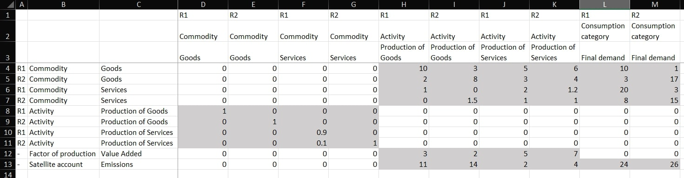

Parsing custom database
=======================

This tutorial shows how to build a custom database in Excel and how to
parse it using MARIO.

Parsing from Excel
------------------

Start by opening Excel or any equivalent software. Any custom
MARIO-readable IOT must follow these rules: - It must be in .xlsx format
- It must have two sheets. The first must contain the table, the second
must be named “units” and contains the info on units of measure

For instance, the following example is for a SUT of 2 regions, 2
commodities and 2 activities.

Table sheet
~~~~~~~~~~~

   Alt text

The structure is the same for both IOTs and SUTs with the difference
SUTs must differenciate between activities and commodities, while IOTs
just needs sectors. You will notice: - There must be 3 level of indices
on both rows and columns - The first level is always the name of the
region, apart from those table sets not defined on regions, such as
“Factor of production” and “Satellite account”. For these two sets, just
provide “-”. - The second level is always the name of the set
(i.e. “Activity”, “Commodity”, “Consumption category”, “Factor of
production”, “Satellite account”). In case of an IOT, provide “Sector”
instead of “Activity” and “Commodity” - The third level is a label,
referring to the name of the item - There must not be blank cells within
the matrices There are no particular rules for the order of the labels
and sets, MARIO will always sort all the indices in alphabetical order
before doing any calculation.

Units sheet
~~~~~~~~~~~

Regardin unit of measures, this sheet must be named “units” and the
header of the column of units (column C of the sheet) must be labelled
“unit” as in the following example

.. figure:: units_example.jpg
   :alt: Alt text

   Alt text

Again the rules are on the indices, that must be provided for all the
labels, avoiding repeating the same label for multiple regions: regions
indeed are not required in this sheet. MARIO can handle hybrid-units
databases.

Parsing a customized database
-----------------------------

Once the customized database is prepared in Excel, just provide the
path, type of table (SUT or IOT) and the mode (flows or coefficients)
and MARIO will be able to parse it using the “parse_from_excel” function

.. code:: ipython3

    import mario  # Import MARIO
    
    path = 'custom_SUT.xlsx'  # Define the desired path to the folder where Exiobase should be downloaded
    
    database = mario.parse_from_excel(
        path = path,
        table = 'SUT',
        mode = 'flows',
    )

.. code:: ipython3

    database.X

.. raw:: html

    

    
    <table border="1" class="dataframe">
      <thead>
        <tr style="text-align: right;">
          <th></th>
          <th></th>
          <th>Item</th>
          <th>production</th>
        </tr>
        <tr>
          <th>Region</th>
          <th>Level</th>
          <th>Item</th>
          <th></th>
        </tr>
      </thead>
      <tbody>
        <tr>
          <th rowspan="2" valign="top">R1</th>
          <th rowspan="2" valign="top">Activity</th>
          <th>Production of Goods</th>
          <td>1.0</td>
        </tr>
        <tr>
          <th>Production of Services</th>
          <td>0.9</td>
        </tr>
        <tr>
          <th rowspan="2" valign="top">R2</th>
          <th rowspan="2" valign="top">Activity</th>
          <th>Production of Goods</th>
          <td>1.0</td>
        </tr>
        <tr>
          <th>Production of Services</th>
          <td>1.2</td>
        </tr>
        <tr>
          <th rowspan="2" valign="top">R3</th>
          <th rowspan="2" valign="top">Activity</th>
          <th>Production of Goods</th>
          <td>1.0</td>
        </tr>
        <tr>
          <th>Production of Services</th>
          <td>0.9</td>
        </tr>
        <tr>
          <th rowspan="2" valign="top">R1</th>
          <th rowspan="2" valign="top">Commodity</th>
          <th>Goods</th>
          <td>45.0</td>
        </tr>
        <tr>
          <th>Services</th>
          <td>31.4</td>
        </tr>
        <tr>
          <th rowspan="2" valign="top">R2</th>
          <th rowspan="2" valign="top">Commodity</th>
          <th>Goods</th>
          <td>66.0</td>
        </tr>
        <tr>
          <th>Services</th>
          <td>44.0</td>
        </tr>
        <tr>
          <th rowspan="2" valign="top">R3</th>
          <th rowspan="2" valign="top">Commodity</th>
          <th>Goods</th>
          <td>61.0</td>
        </tr>
        <tr>
          <th>Services</th>
          <td>44.0</td>
        </tr>
      </tbody>
    </table>
    

The same structure is replicable for IOT database. If you want to see
how the table should look like, you can load the test models and save
them to excel to have a closer look to the structure:

.. code:: ipython3

    mario.load_test("IOT").to_excel("test_iot.xlsx")

Parsing from pd.DataFrames
--------------------------

You can also build a mario.Database, using pd.DataFrames:

.. code:: ipython3

    from mario import Database
    import pandas as pd
    import numpy as np

.. code:: ipython3

    # Creating indeces according to mario format
    regions  = ['reg.1']
    Z_levels = ['Sector']
    sectors  = ['sec.1','sec.2']
    
    factors   = ['Labor']
    satellite = ['CO2'] 
    
    
    Y_level = ['Consumption category']
    demands = ['Households']
    
    Z_index   = pd.MultiIndex.from_product([regions,Z_levels,sectors])
    Y_columns = pd.MultiIndex.from_product([regions,Y_level,demands])

.. code:: ipython3

    # creating matrices
    Z = pd.DataFrame(
        data =  np.array([
                [10,70],
                [50,10]]),
        index = Z_index,
        columns= Z_index
    )
    Y = pd.DataFrame(
        data =  np.array([
                [200],
                [80]]),
        index = Z_index,
        columns= Y_columns,
    )
    E = pd.DataFrame(
        data =  np.array([
                [30,20]]),
        index = satellite,
        columns= Z_index,
    )
    V = pd.DataFrame(
        data =  np.array([
                [220,60]]),
        index = factors,
        columns= Z_index,
    )
    EY = pd.DataFrame(
        data =  np.array([8]),
        index = satellite,
        columns= Y_columns,
    )

.. code:: ipython3

    Z

.. raw:: html

    

    
    <table border="1" class="dataframe">
      <thead>
        <tr>
          <th></th>
          <th></th>
          <th></th>
          <th colspan="2" halign="left">reg.1</th>
        </tr>
        <tr>
          <th></th>
          <th></th>
          <th></th>
          <th colspan="2" halign="left">Sector</th>
        </tr>
        <tr>
          <th></th>
          <th></th>
          <th></th>
          <th>sec.1</th>
          <th>sec.2</th>
        </tr>
      </thead>
      <tbody>
        <tr>
          <th rowspan="2" valign="top">reg.1</th>
          <th rowspan="2" valign="top">Sector</th>
          <th>sec.1</th>
          <td>10</td>
          <td>70</td>
        </tr>
        <tr>
          <th>sec.2</th>
          <td>50</td>
          <td>10</td>
        </tr>
      </tbody>
    </table>
    

.. code:: ipython3

    Y

.. raw:: html

    

    
    <table border="1" class="dataframe">
      <thead>
        <tr>
          <th></th>
          <th></th>
          <th></th>
          <th>reg.1</th>
        </tr>
        <tr>
          <th></th>
          <th></th>
          <th></th>
          <th>Consumption category</th>
        </tr>
        <tr>
          <th></th>
          <th></th>
          <th></th>
          <th>Households</th>
        </tr>
      </thead>
      <tbody>
        <tr>
          <th rowspan="2" valign="top">reg.1</th>
          <th rowspan="2" valign="top">Sector</th>
          <th>sec.1</th>
          <td>200</td>
        </tr>
        <tr>
          <th>sec.2</th>
          <td>80</td>
        </tr>
      </tbody>
    </table>
    

You also need to identify the units in a separate python dict as follow:

.. code:: ipython3

    # units as a dict of pd.DataFrames
    units= {
        'Sector':pd.DataFrame('EUR',index=sectors,columns=['unit']),
        'Satellite account':pd.DataFrame('Ton',index=satellite,columns=['unit']),
        'Factor of production': pd.DataFrame('EUR',index=factors,columns=['unit'])
        }

.. code:: ipython3

    units

.. parsed-literal::

    {'Sector':       unit
     sec.1  EUR
     sec.2  EUR,
     'Satellite account':     unit
     CO2  Ton,
     'Factor of production':       unit
     Labor  EUR}

Now you can create a mario.Database object:

.. code:: ipython3

    # Creating a mario database
    data = Database(
        Z=Z,            
        Y=Y,
        E=E,
        V=V,
        EY=EY,
        table='IOT',
        units=units,
        name='iot test'
    )

.. code:: ipython3

    data.z

.. raw:: html

    

    
    <table border="1" class="dataframe">
      <thead>
        <tr>
          <th></th>
          <th></th>
          <th>Region</th>
          <th colspan="2" halign="left">reg.1</th>
        </tr>
        <tr>
          <th></th>
          <th></th>
          <th>Level</th>
          <th colspan="2" halign="left">Sector</th>
        </tr>
        <tr>
          <th></th>
          <th></th>
          <th>Item</th>
          <th>sec.1</th>
          <th>sec.2</th>
        </tr>
        <tr>
          <th>Region</th>
          <th>Level</th>
          <th>Item</th>
          <th></th>
          <th></th>
        </tr>
      </thead>
      <tbody>
        <tr>
          <th rowspan="2" valign="top">reg.1</th>
          <th rowspan="2" valign="top">Sector</th>
          <th>sec.1</th>
          <td>0.035714</td>
          <td>0.500000</td>
        </tr>
        <tr>
          <th>sec.2</th>
          <td>0.178571</td>
          <td>0.071429</td>
        </tr>
      </tbody>
    </table>
    

.. code:: ipython3

    data.p

.. parsed-literal::

    Database: to calculate p following matrices are need.
    ['w'].Trying to calculate dependencies.

.. raw:: html

    

    
    <table border="1" class="dataframe">
      <thead>
        <tr style="text-align: right;">
          <th></th>
          <th></th>
          <th></th>
          <th>price index</th>
        </tr>
        <tr>
          <th>Region</th>
          <th>Level</th>
          <th>Item</th>
          <th></th>
        </tr>
      </thead>
      <tbody>
        <tr>
          <th rowspan="2" valign="top">reg.1</th>
          <th rowspan="2" valign="top">Sector</th>
          <th>sec.1</th>
          <td>1.0</td>
        </tr>
        <tr>
          <th>sec.2</th>
          <td>1.0</td>
        </tr>
      </tbody>
    </table>
    

:download:`Link to the jupyter notebook file </../notebooks/tutorial_parse_custom_database.ipynb>`.
