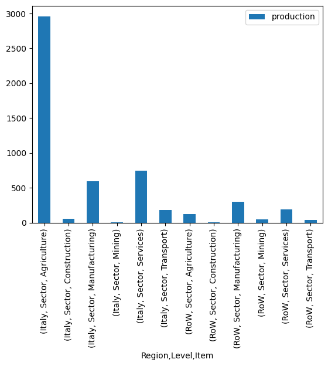
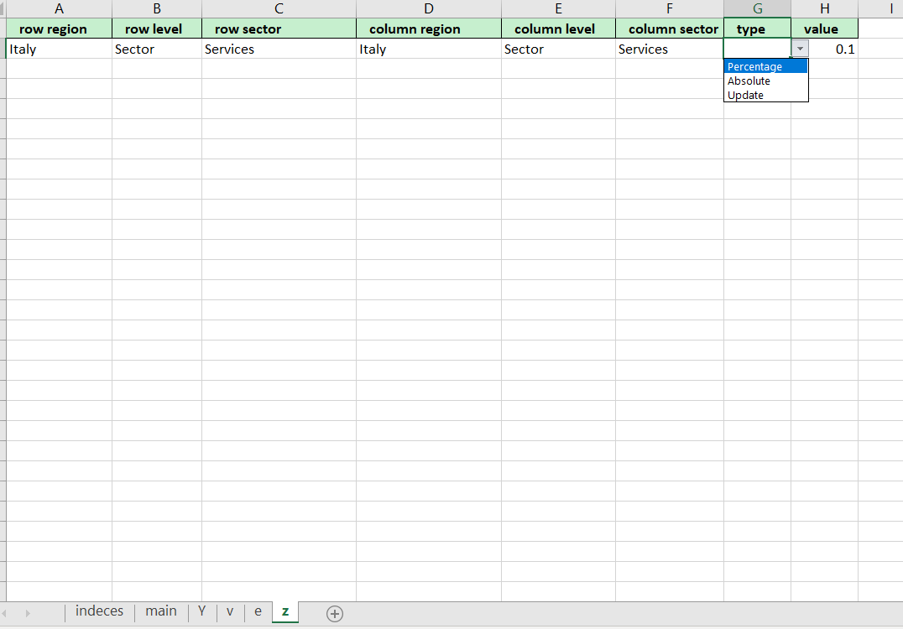
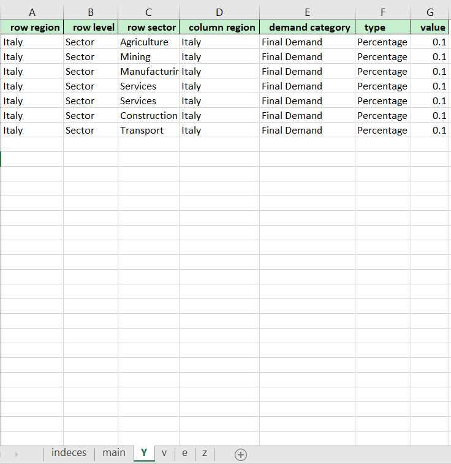

Shcok Analysis
==============

A scenario can be implemented in multiple ways within mario.

Shock implementation using python script
----------------------------------------

In this approach, you need to use the pandas functions properly to
implement changes in your database, and update the matrices in mario
scenario accordingly. Lets load the test example to see how it works.

.. code:: ipython3

    from mario import load_test,slicer

.. code:: ipython3

    test = load_test("IOT")

Let’s assume you want to model a final demand increase scenario in your
database. The first step would be to clone a new scneario from baseline
data:

.. code:: ipython3

    test.clone_scenario(
        scenario='baseline', # from which scenario clone  
        name='Final demand increase',# what will be the name of the new scenario
    )
    
    print(test.scenarios)

.. parsed-literal::

    ['baseline', 'Final demand increase']

Now lets assume you want to increase the local final demand of
agriculture sectors in Italy by 10%. This is how the matrix of final
demand (Y) looks like:

.. code:: ipython3

    test.Y

.. raw:: html

    

    
    <table border="1" class="dataframe">
      <thead>
        <tr>
          <th></th>
          <th></th>
          <th>Region</th>
          <th>Italy</th>
          <th>RoW</th>
        </tr>
        <tr>
          <th></th>
          <th></th>
          <th>Level</th>
          <th>Consumption category</th>
          <th>Consumption category</th>
        </tr>
        <tr>
          <th></th>
          <th></th>
          <th>Item</th>
          <th>Final Demand</th>
          <th>Final Demand</th>
        </tr>
        <tr>
          <th>Region</th>
          <th>Level</th>
          <th>Item</th>
          <th></th>
          <th></th>
        </tr>
      </thead>
      <tbody>
        <tr>
          <th rowspan="6" valign="top">Italy</th>
          <th rowspan="6" valign="top">Sector</th>
          <th>Agriculture</th>
          <td>2.843471e+04</td>
          <td>4.875449e+03</td>
        </tr>
        <tr>
          <th>Construction</th>
          <td>1.447732e+05</td>
          <td>4.655076e+02</td>
        </tr>
        <tr>
          <th>Manufacturing</th>
          <td>2.998989e+05</td>
          <td>2.316510e+05</td>
        </tr>
        <tr>
          <th>Mining</th>
          <td>9.219922e+02</td>
          <td>2.023559e+02</td>
        </tr>
        <tr>
          <th>Services</th>
          <td>1.052847e+06</td>
          <td>5.080214e+04</td>
        </tr>
        <tr>
          <th>Transport</th>
          <td>5.738525e+04</td>
          <td>5.686902e+03</td>
        </tr>
        <tr>
          <th rowspan="6" valign="top">RoW</th>
          <th rowspan="6" valign="top">Sector</th>
          <th>Agriculture</th>
          <td>1.099317e+04</td>
          <td>2.073065e+06</td>
        </tr>
        <tr>
          <th>Construction</th>
          <td>1.072044e+03</td>
          <td>1.059925e+07</td>
        </tr>
        <tr>
          <th>Manufacturing</th>
          <td>1.217507e+05</td>
          <td>1.816087e+07</td>
        </tr>
        <tr>
          <th>Mining</th>
          <td>4.621724e+02</td>
          <td>4.603934e+05</td>
        </tr>
        <tr>
          <th>Services</th>
          <td>4.307168e+04</td>
          <td>4.842609e+07</td>
        </tr>
        <tr>
          <th>Transport</th>
          <td>8.726021e+03</td>
          <td>3.100367e+06</td>
        </tr>
      </tbody>
    </table>
    

So you need to slice the database properly to increase the total final
demand of agriculture sector in Italy. For easier use, you can use mario
slicer function in case you dont want to deal with slicing of pandas
through loc function:

.. code:: ipython3

    Y_rows = slicer(matrix='Y',axis= 0,Region=['Italy'],Item=['Agriculture'])
    Y_cols = slicer(matrix='Y',axis= 1,Region=['Italy'],Item=['Final Demand'])

Now you can increase the specific value by 10% as:

.. code:: ipython3

    Y_new = test.query(
        matrices = "Y",
        scenarios="Final demand increase"
        )

.. code:: ipython3

    Y_new.loc[Y_rows,Y_cols] *= 1.1

.. code:: ipython3

    print("Baseline Y",test.Y.loc[Y_rows,Y_cols])
    print("Scenario Y",Y_new.loc[Y_rows,Y_cols])

.. parsed-literal::

    Baseline Y Region                                   Italy
    Level                     Consumption category
    Item                              Final Demand
    Region Level  Item                            
    Italy  Sector Agriculture         28434.707841
    Scenario Y Region                                   Italy
    Level                     Consumption category
    Item                              Final Demand
    Region Level  Item                            
    Italy  Sector Agriculture         31278.178625

Now you need to update the scenario data then reset all the matrices of
scenario to coefficients only (as they are not changed!), to recaulcuate
the matrices again.

.. code:: ipython3

    test.update_scenarios(scenario='Final demand increase',Y=Y_new)
    test.reset_to_coefficients(scenario='Final demand increase')

Lets take a look to a graph to see how things look like:

.. code:: ipython3

    # Change in total production
    delta_X = test.query(
        matrices = "X", # which matrix
        scenarios = "Final demand increase", # take the new scenario
        base_scenario="baseline", # take the base scenario
        type = "absolute" # calcualte the absolute changes
    )

.. code:: ipython3

    delta_X

.. raw:: html

    

    
    <table border="1" class="dataframe">
      <thead>
        <tr style="text-align: right;">
          <th></th>
          <th></th>
          <th></th>
          <th>production</th>
        </tr>
        <tr>
          <th>Region</th>
          <th>Level</th>
          <th>Item</th>
          <th></th>
        </tr>
      </thead>
      <tbody>
        <tr>
          <th rowspan="6" valign="top">Italy</th>
          <th rowspan="6" valign="top">Sector</th>
          <th>Agriculture</th>
          <td>2961.338965</td>
        </tr>
        <tr>
          <th>Construction</th>
          <td>57.329630</td>
        </tr>
        <tr>
          <th>Manufacturing</th>
          <td>597.267115</td>
        </tr>
        <tr>
          <th>Mining</th>
          <td>6.332699</td>
        </tr>
        <tr>
          <th>Services</th>
          <td>745.379267</td>
        </tr>
        <tr>
          <th>Transport</th>
          <td>185.686254</td>
        </tr>
        <tr>
          <th rowspan="6" valign="top">RoW</th>
          <th rowspan="6" valign="top">Sector</th>
          <th>Agriculture</th>
          <td>121.156060</td>
        </tr>
        <tr>
          <th>Construction</th>
          <td>5.421589</td>
        </tr>
        <tr>
          <th>Manufacturing</th>
          <td>302.857308</td>
        </tr>
        <tr>
          <th>Mining</th>
          <td>45.949173</td>
        </tr>
        <tr>
          <th>Services</th>
          <td>193.241123</td>
        </tr>
        <tr>
          <th>Transport</th>
          <td>36.432992</td>
        </tr>
      </tbody>
    </table>
    

.. code:: ipython3

    delta_X.plot(kind="bar")

.. parsed-literal::

    <Axes: xlabel='Region,Level,Item'>

Implementing a shock using mario excel platform
-----------------------------------------------

mario also supports introduction of very complex shocks through an excel
platform, which can be generated with mario automatically based on the
shape of the database. Then scenarios can be translated with the options
of the excel files.

The excel platform alos gives the opprotunity to define cluseters of
sets like Region, Secotr,…. to implement more complex shocks.

Lets implement a different shock, by first loading a fresh test example.

.. code:: ipython3

    test = load_test("IOT")

You can ask mario to generate an excel file where you can fill your
shocks!

.. code:: ipython3

    save_path = "shock_iot.xlsx"
    test.get_shock_excel(path=save_path)

An excel file will be created in the given path. The excel file has 6
different pages as follow:

1. indeces: this page contains all the valid data that can be used for
   the definition of the shocks. These values are used to validate the
   data on other sheets
2. main: This sheet is an optional sheet that user may use for the
   intermediate calculations and defining the assumptions of the problem
3. Y: This sheet is specified for implementing a shock on the Final
   demand
4. v: This sheet is specified for implementing a shock on tha value
   added
5. e: This sheet is specified for implementing a shock on the satellite
   account
6. z: This sheet is specified for implementing a shock on the
   intersectoral transaction matrix

In this version of mario, there are different ways to implement a shock
(more options will be added to the next versions):

1. update: this method updates a value on the coefficient matrix
2. Absolute: this method implements the change in terms of absolute
   values (flows) and implement the change on coefficient matrix
3. Percentage: this method implements a percentage change directly on
   coefficient matrix (the values should be between 0 to 1 meaning that
   10% increase is 0.1 and 10% decrease is -0.1)

For example, a scenario with 10% increase in the self consumption of
services sector in Italy can be modeled in the excel file as follow:

   Alt text

Let’s assume that we fill the excel file, and call it
shock_iot_filled.xlsx. To implement the shock, you can:

.. code:: ipython3

    test.shock_calc(
        io=r'shock_iot_filled.xlsx', # Path to the excel file
        z= True, # the shock will be implemented on z
        notes=['you may add some notes for metadata']
    )

.. code:: ipython3

    test.scenarios

.. parsed-literal::

    ['baseline', 'shock 1']

If you dont choose a name for your shock, mario will do it for you!

Defining the Clusters
~~~~~~~~~~~~~~~~~~~~~

In order to impelemnt shocks on a bunch of items, you can use clusters.
Lets implement a change in the local final demand of all sectors in
italy for 10%, first without the clusters.

In this way, user needs to replicate the same change for all the sectros
in italy as shown in the picture

   Alt text

n easier way to this shock is to use clusters. In this case user needs
to define a cluster on the ‘Sector’. But clusters can be defined on all
the sets of the table (for checking all the sets of table you can use
test.sets)

A cluster on sectors can be defined as follow:

.. code:: ipython3

    clusters = {'Sector': # Cluster on which set
                        {'All': test.get_index('Sector')    # what is the name of the cluster and what it contains
                        }
               }

So in this case, we are making a cluster on Sector. The cluster will be
called All and it contains all the Sectors in the database. Now if we
request mario to generate the shock excel, ‘All’ is added as a valid
option for the Sector.

.. code:: ipython3

    save_path = 'shock_iot_cluster.xlsx'
    test.get_shock_excel(path=save_path,**clusters)

The same shock now can be implemented as the shown in the pic:

.. figure:: cluster.png
   :alt: Alt text

   Alt text

In order to implement a shock, we need to use the excel files and the
definition of clusters as follow. Let’s assume we call the filled excel
file as shock_iot_cluster_filled.xlsx:

.. code:: ipython3

    test.shock_calc(
        io=r'shock_iot_cluster_filled.xlsx', # Path to the excel file
        Y= True, # the shock will be implemented on Y
        **clusters
    )

.. code:: ipython3

    test.scenarios

.. parsed-literal::

    ['baseline', 'shock 1', 'shock 2']

Just to understand what is happening behind the scene, you can take a
look to the metadata history:

.. code:: ipython3

    test.meta_history

.. parsed-literal::

    [2024-06-26 18:54:48]    Table added into metadata with value equal to IOT.
    [2024-06-26 18:54:48]    Price added into metadata with value equal to None.
    [2024-06-26 18:54:48]    Source added into metadata with value equal to None.
    [2024-06-26 18:54:48]    Year added into metadata with value equal to None.
    [2024-06-26 18:54:48]    Shocks implemented from shock_iot_filled.xlsx as follow:
    [2024-06-26 18:54:48]    Shock (Notes): you may add some notes for metadata
    [2024-06-26 18:54:48]    Shock on z implemented: row_region_:Italy, row_level_:Sector, row_sector_:Services, column_region_:Italy, column_level_:Sector column_sector_:Services, type: Percentage, value: 0.1.
    [2024-06-26 18:54:48]    Shocks implemented from shock_iot_cluster_filled.xlsx as follow:
    [2024-06-26 18:54:48]    Shock on Y implemented: row_region:Italy, row_level:Sector, row_sector:['Agriculture', 'Mining', 'Manufacturing', 'Services', 'Construction', 'Transport'], column_region:Italy, demand_category: Final Demand, type: Percentage, value: 0.1.

:download:`Link to the jupyter notebook file </../notebooks/tutorial_shock_analysis.ipynb>`.
