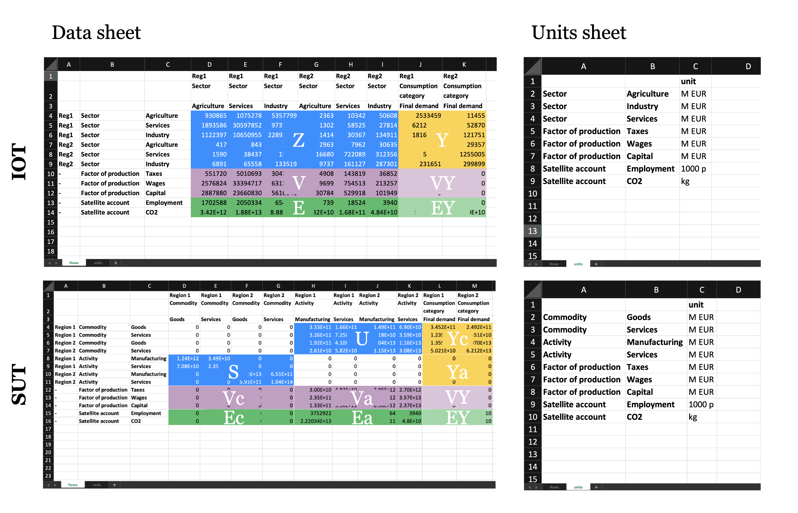
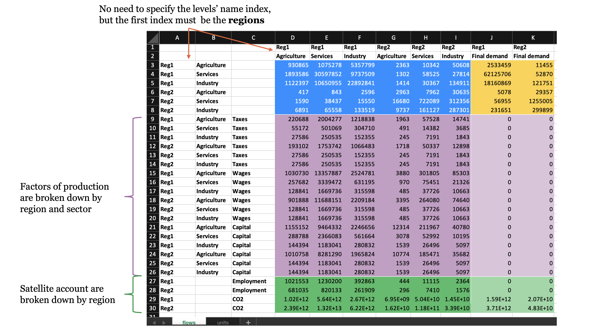

From Excel
==========

MARIO supports custom parsing from Excel workbooks when the database is
organized acording to a canonical structure.

This is usually the easiest entry point when you are assembling a custom
database manually or when you want one human-readable file containing both data
and units.

.. important::
  If your *database* is not yet supported by dedicated parsing methods,
  :doc:`there are methods to support you in setting it up in the MARIO-readable format <../workflows/provide_your_database>`

Recommended entry point
-----------------------

For normal user workflows, the public entry point is:

* :doc:`mario.parse_from_excel(...) <../api_document/mario.parse_from_excel>`

Key arguments
-------------

The key public arguments are:

* ``path``:
  path to the workbook to parse;
* ``table``:
  choose ``"IOT"`` or ``"SUT"``;
* ``mode``:
  choose ``"flows"`` or ``"coefficients"``;
* ``data_sheet``:
  sheet selector when the input-output accounts (optional if they are in the first sheet);
* ``unit_sheet``:
  sheet selector for the units (optional if the sheet is not called ``units``);
* ``matrix_layouts``:
  optional per-matrix semantic declarations for non-standard IOT layouts;
* ``tech_assumption``:
  optional SUT-only selector for ``IT`` / ``PT`` :doc:`technology assumptions <../concepts/technology_assumptions>`.

Expected path structure
-----------------------

``path`` must point to one Excel workbook:

.. code-block:: text

   custom_database.xlsx
   ├── data sheet
   └── units sheet

The data sheet can be the canonical matrix layout exported by MARIO or a flat
template generated with ``mario.write_parse_template(...)``. The units sheet
must contain the units for sectors, activities, commodities, factors of
production, final demand, and satellite accounts used by the workbook.

Standard Excel workbook layout
------------------------------

The ``mario.parse_from_excel(...)`` method expects:

* one data sheet containing the *table*;
* one units sheet.

The *table* should be structured to follow MARIO's canonical configuration. 
2 sheets are needed

**Data sheet**

*Table*'s data must be provided with 3 level of indices on both rows and columns. 

* Index 1 must be the *regions*, also for single-region *tables*
* Index 2 contains the levels’ name (*Sector*, *Factor of production*, …)
* Index 3 contains the levels’ labels

If data are provided in the first sheet, the name is not relevant, else, use the ``data_sheet`` argument
The data can be provided both in flows or coefficients, using the ``mode`` argument

**Units sheet**

Unique list of *sectors/activities/commodities*, *factors of production*, *satellite accounts* with the related units.
A sheet named **units** must be present, else, use the ``unit_sheet`` argument to select the right sheet.

   Standard layout of the MARIO-reabable Excel template for parsing *tables*. Following this layout, any IOT or SUT can be parsed.

To parse a standard Excel workbook:

.. code-block:: python

   import mario

   db = mario.parse_from_excel(
       path="/path/to/standard_workbook.xlsx",
       table="SUT", # or IOT
       mode="flows", # or coefficients
       tech_assumption="IT", # or PT, optional for SUTs
   )

.. _special_layout:

Special Excel workbook layouts
------------------------------

From v1.0.0, the ``matrix_layouts`` argument has been introduced to allow for non-standard layouts for the IOT matrices.
Provided MARIO *indices* (e.g. *regions*, *sectors*, *factors of production*...) are be fixed, some tables may benefit from extra layers of detail with respect to the standard layout.

The most common case is when *factors of production* or *satellite accounts* are broken down by
*sector/activity/commodity* or *regions*, instead of being aggregated in a single index. 
In this case, the ``matrix_layouts`` argument allows to declare the extra layers of detail and their semantic meaning.

   Special layout of the MARIO-reabable Excel template for parsing *tables*. Example for IOTs

To parse a special Excel workbook, like the one in the figure above, you can use the ``matrix_layouts`` argument to declare the extra layers of detail:

.. code-block:: python

   import mario

   db = mario.parse_from_excel(
       path="/path/to/special_workbook.xlsx",
       table="IOT", # or SUT
       mode="flows", # or coefficients
        matrix_layouts={
          'V': ('Region', 'Sector'),  # order must be consistent with the one provided in the data sheet
          'E': 'Region' # if just one extra index, you can avoid using tuples
        },
   )

N.B. The logic underlying the *units* sheet is always the same in both standard and special layouts.

.. important::
  * When defining ``E`` and/or ``V`` *matrices* with extra indices, you MUST use the full list of labels under those indices (e.g. all the *sectors* and *regions* in the example above)
  * No need to speficy levels for ``VY`` and ``EY`` matrices, they will follow the same layout as ``V`` and ``E`` respectively

Notebook walkthrough
--------------------

Use the notebook below as the main parser guide:

* :doc:`Excel parser walkthrough <../notebooks/parsers/custom_database/from_excel>`

If you prefer to run it locally, you can also download the source notebook:

* :download:`Download the Excel notebook <../notebooks/parsers/custom_database/from_excel.ipynb>`

The notebook uses the packaged MARIO-readable Excel workbooks below. Download
them next to the notebook, or place them in a ``data/`` folder next to it:

* :download:`test_IOT_standard.xlsx <../../../mario/test/new/test_IOT_standard.xlsx>`
* :download:`test_IOT_special.xlsx <../../../mario/test/new/test_IOT_special.xlsx>`
* :download:`test_SUT_standard.xlsx <../../../mario/test/new/test_SUT_standard.xlsx>`
* :download:`test_SUT_special.xlsx <../../../mario/test/new/test_SUT_special.xlsx>`

.. toctree::
   :hidden:

   ../notebooks/parsers/custom_database/from_excel

Caveats
-------

* Excel is usually the simplest way to start, but it is not the most robust
  format for large roundtrip workflows;
* This parser does not infer ``flows`` versus ``coefficients`` automatically: you need to specify the ``mode`` argument.
