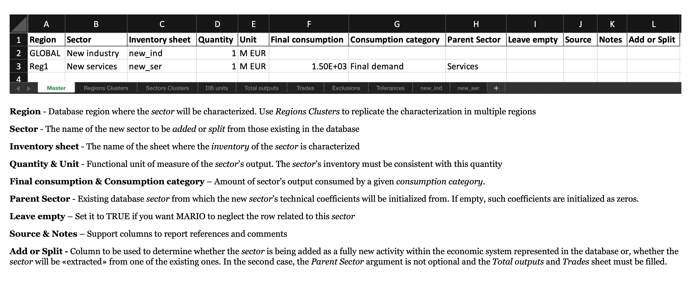
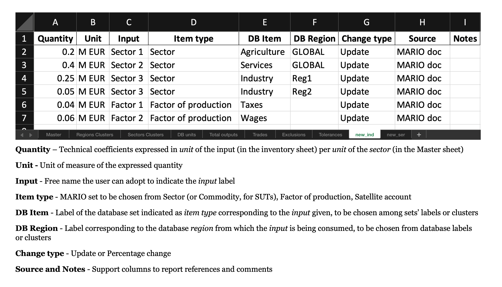
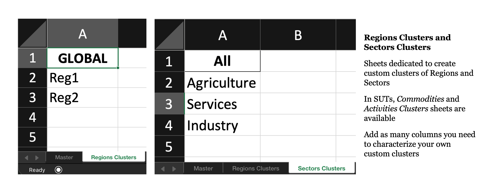

Add Sectors
===========

The add-sectors workflow lets you extend an existing MARIO database through one
Excel workbook. This is the most user-friendly route when you want to describe
new sectors manually, keep the assumptions readable, and work directly in Excel.

The public workflow is:

1. generate an empty workbook with ``db.get_add_sectors_excel(...)``;
2. fill the ``Master`` sheet;
3. create or refresh the inventory sheets with ``db.read_add_sectors_excel(..., get_inventories=True)``;
4. fill the inventory sheets in Excel;
5. read the completed workbook with ``db.read_add_sectors_excel(..., read_inventories=True)``;
6. apply it with ``db.add_sectors(...)``.

Minimal workflow
----------------

.. code-block:: python

   import mario

   db = mario.load_test("IOT")

   db.get_add_sectors_excel(
       path="/path/to/add_sectors.xlsx",
       overwrite=True,
   )

   db.read_add_sectors_excel(
       path="/path/to/add_sectors.xlsx",
       get_inventories=True,
   )

   db.read_add_sectors_excel(
       path="/path/to/add_sectors.xlsx",
       read_inventories=True,
   )

   new_db = db.add_sectors(inplace=False)

Workbook structure
------------------

Every generated workbook contains the structural sheets MARIO needs to read the
extension:

* ``Master``: one row per new item to add or split;
* ``Regions Clusters``: optional aliases for multiple database regions;
* one item-cluster sheet:
  ``Sectors Clusters`` for IOT or ``Commodities Clusters`` for SUT;
* ``DB units``: read-only reference sheet listing the units already used in the database.

For IOT workbooks, split support sheets are also available when at least one row
is marked as ``Split``:

* ``Total outputs``;
* ``Trades``;
* ``Exclusions``;
* ``Tolerances``.

The screenshots below illustrate the IOT workbook layout. SUT follows the same
logic, but the ``Master`` sheet uses ``Activity`` and ``Commodity`` instead of
``Sector``, includes ``Market share``, and does not expose ``Add or Split``.

The master sheet
----------------

   ``Master`` sheet generated by the add-sectors template for IOT.

The ``Master`` sheet defines the high-level structure of the extension:

* ``Region``:
  target database region. You can also use a region cluster name defined in
  ``Regions Clusters`` to replicate the same characterization in multiple
  regions.
* ``Sector``:
  name of the new sector. In SUT this becomes ``Activity`` and ``Commodity``.
* ``Inventory sheet``:
  name of the Excel tab containing the inventory for that row.
* ``Quantity`` and ``Unit``:
  functional unit of the new sector's output. Inventory coefficients should be
  consistent with this unit.
* ``Final consumption`` and ``Consumption category``:
  optional final demand assigned to the new item. If the category is left
  empty, MARIO falls back to the first final-demand category in the database.
* ``Parent Sector``:
  existing database sector used as the reference structure when you want MARIO
  to initialize or scale coefficients from an existing activity.
* ``Leave empty``:
  when set to ``TRUE``, MARIO skips that inventory sheet entirely.
* ``Source`` and ``Notes``:
  free support columns for references and comments.
* ``Add or Split``:
  IOT-only selector. Use ``Add`` for a fully new sector and ``Split`` when the
  new sector should be extracted from a parent sector.

Practical notes:

* ``Parent Sector`` is optional for a normal add workflow, but it becomes
  necessary when you want to use percentage changes or the split workflow.
* If you mark a row as ``Split``, the split-support sheets must also be filled.
* The same inventory sheet name can be reused across multiple ``Master`` rows
  when you want to apply one characterization to multiple target regions.

The inventory sheets
--------------------

   Inventory sheet used to characterize one new sector.

Each inventory sheet describes the inputs used by the new item:

* ``Quantity``:
  technical coefficient per unit of output declared in ``Master``.
* ``Unit``:
  unit of the coefficient. Use ``DB units`` as the workbook reference.
* ``Input``:
  free label for the user. MARIO does not use it as a database key.
* ``Item type``:
  database set to target. In IOT this is typically ``Sector``,
  ``Factor of production``, or ``Satellite account``. In SUT you can also use
  ``Commodity``.
* ``DB Item``:
  existing database label that the input refers to. For item inputs you can
  also use a cluster name from the item-cluster sheet.
* ``DB Region``:
  source region of the input. This can be a database region or a region
  cluster.
* ``Change type``:
  use ``Update`` for an absolute coefficient, or ``Percentage`` to apply a
  relative change to the parent structure. ``Percentage`` requires a parent in
  the ``Master`` sheet.
* ``Source`` and ``Notes``:
  support columns for documentation.

The cluster sheets
------------------

   Cluster sheets used to define reusable region and item groups.

Cluster sheets are optional, but they make the workbook much more compact:

* every column header is one cluster name;
* each non-empty cell below the header is one member of that cluster;
* region clusters can be referenced in ``Master.Region`` and in
  ``Inventory.DB Region``;
* item clusters can be referenced in ``Inventory.DB Item``.

For IOT, the item sheet is ``Sectors Clusters``. For SUT, the current workbook
uses ``Commodities Clusters``.

Split support sheets
--------------------

If at least one IOT row is marked as ``Split``, MARIO also relies on these
additional tabs:

* ``Total outputs``:
  target outputs for each split sector and region;
* ``Trades``:
  trade structure associated with the split sectors;
* ``Exclusions``:
  sector pairs to exclude from the split optimization;
* ``Tolerances``:
  numerical tolerances for the split model.

The split workflow is stricter than a normal add workflow:

* ``split=True`` is available only for IOT databases;
* every split sector must have a ``Parent Sector`` in ``Master``;
* the ``Total outputs`` sheet must contain all sectors marked as ``Split``;
* ``cvxlab_path`` is required when you actually run ``db.add_sectors(..., split=True)``.

Notebook walkthrough
--------------------

Use the notebook below as the main add-sectors guide:

* :doc:`Add sectors walkthrough <../../notebooks/user_guide/transformations/add_sectors>`

If you prefer to run it locally, you can also download the source notebook:

* :download:`Download the add-sectors notebook <../../notebooks/user_guide/transformations/add_sectors.ipynb>`
